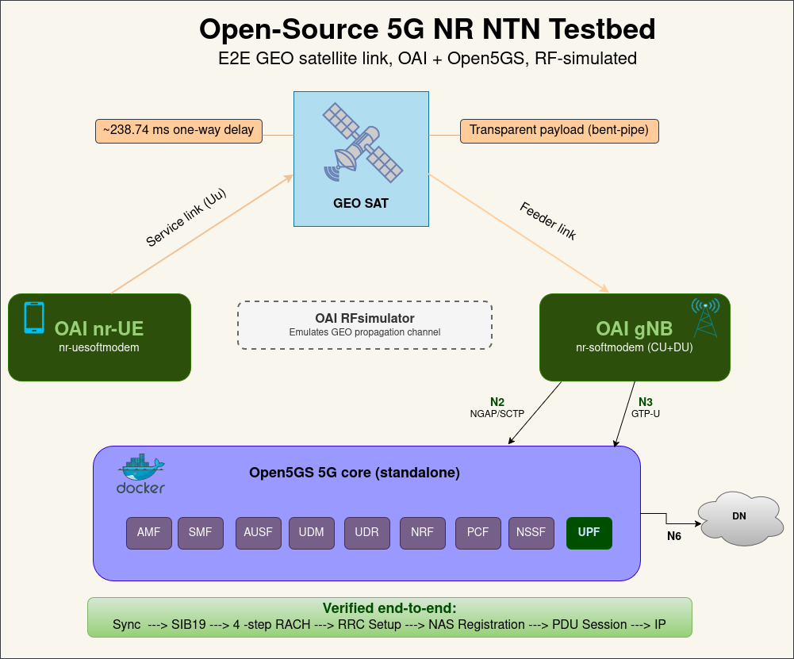
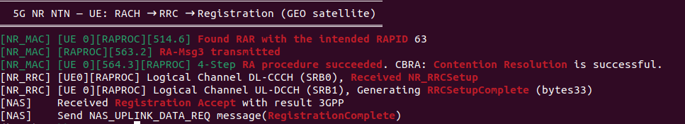
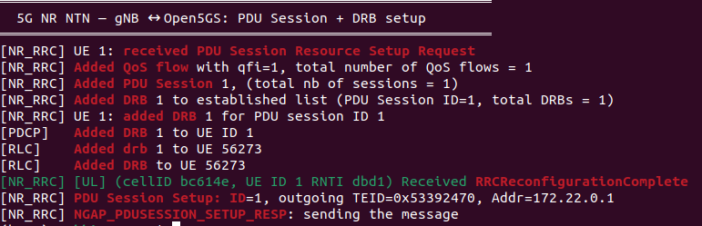

# Open-Source 5G NR Non-Terrestrial Network (NTN) Testbed

[](https://doi.org/10.5281/zenodo.20588732)

A reproducible, fully open-source testbed for **5G NR Non-Terrestrial Networks**, demonstrating a complete **end-to-end GEO satellite attach** (from cell sync through to an established data session), using only open-source components and no SDR hardware.

Built on **OpenAirInterface (OAI)** and **Open5GS**, with a GEO satellite link emulated in OAI's RFsimulator. Every dependency is pinned by commit; every configuration change and design decision is recorded.



---

## What works today

A full **3GPP Release-17 GEO NTN attach**, verified end to end against a live 5G core over an emulated 238.74 ms one-way (~477 ms round-trip) satellite link:

**cell sync -> SIB19 acquisition -> 4-step RACH -> RRC Setup -> NAS registration -> PDU session establishment -> IP connectivity**

| Component | Implementation |
|---|---|
| **UE** | OAI `nr-uesoftmodem` (GNSS-aware, computes NTN timing advance) |
| **gNB** | OAI `nr-softmodem` (CU+DU; broadcasts SIB19, K-offset 478) |
| **RF** | OAI RFsimulator emulating the GEO propagation channel (no SDR) |
| **Core** | Open5GS 5G SA, containerised (Docker Compose) |
| **NTN features** | SIB19 ephemeris, K-offset scheduling, ephemeris-based timing advance, extended RRC timers, HARQ feedback disabled (Rel-17) |

### Verified results

**Random access -> registration (UE side):**



**PDU session + data radio bearer (gNB <-> Open5GS):**



The complete 4-step contention-based RACH succeeds over the GEO round trip, the UE registers with the core, and a PDU session with a dedicated DRB is established.


---

## Reproduce it

> Tested on Ubuntu 22.04. Requires the pinned OAI and Open5GS versions. See [`external/VERSIONS.md`](./external/VERSIONS.md).

1. **Bring up the 5G core** (Open5GS via Docker Compose). See [`lab-notes.md`](./lab-notes.md) Phase 1.
2. **Build OAI** at the pinned commit (tag `2026.w16`) and apply the three patches in [`patches/oai-2026.w16/`](./patches/oai-2026.w16/).
3. **Run gNB and UE** under real-time scheduling (propagation delay is set in the conf files):

```bash
# gNB
sudo chrt -f 80 env RFSIMULATOR=server ./ran_build/build/nr-softmodem \
  -O <repo>/configs/oai-gnb/gnb.sa.band254.u0.25prb.rfsim.ntn.conf \
  --rfsim --gNBs.[0].min_rxtxtime 6

# UE (after gNB shows "Running as server ...")
sudo chrt -f 80 env RFSIMULATOR=127.0.0.1 ./ran_build/build/nr-uesoftmodem \
  -O <repo>/configs/oai-ue/ue.conf \
  --band 254 -C 2488400000 --CO -873500000 \
  -r 25 --numerology 0 --ssb 60 --rfsim
```

Configurations are tracked in [`configs/`](./configs/), kept separate from the upstream OAI clone so every change is visible.

📄 A complete step-by-step deployment guide, covering core, gNB and UE with every command and a validation checklist, is available in [`docs/`](./docs/Open-Source_5G_NR_NTN_Deployment_Guide_v1.pdf).

---

## Known limitations

- **RFsimulator only**. No real radio / SDR.
- **Wall-clock latency does not reflect GEO delay.** The GEO propagation delay is modelled correctly in the *sample/timing domain*, which is precisely why it drives the NTN protocol behaviour (SIB19 timing, K-offset, the RAR-window fix above). However, OAI's RFsimulator is **not real-time**: it processes samples as fast as the CPU allows, so a `ping` over the link returns in tens of milliseconds rather than the ~477 ms a physical GEO round trip would take. The delay is real where it matters for protocol correctness; it is not a wall-clock latency emulator. This is a known property of the RFsimulator, not a configuration issue.
- **Single host, no scale/performance testing**, no certification or regulatory work.

---

## Roadmap

Phases 1, 2, and 3 are **complete**. Later phases are planned and will be added incrementally; see [`PLAN.md`](./PLAN.md) for full detail.

| Phase | Description | Status |
|---|---|---|
| 1 | 5G Core in containers (Open5GS) | Complete |
| 2 | gNB + UE, GEO NTN end-to-end attach | Complete |
| 3 | [Reference architecture document](docs/architecture/Open-Source_5G_NR_NTN_Reference_Architecture.pdf) | Complete |
| 4 | SMS over NAS (SMSoNAS) over NTN | Planned |
| 5 | D2D transport comparison (IP / Non-IP / SMSoNAS) | Planned |
| 6 | Voice-over-NTN delay-budget analysis | Planned |
| 7 | NTN-terrestrial roaming architecture | Planned |
| 8 | Cloud-native deployment (K3s) | Planned |
| 9-10 | LEO primer, AI-RAN sketch (optional) | Planned |

A **LEO testbed** is planned as a separate repository.

---

## Author

**Sabbir Ahmed**, Doctoral Researcher, 6G Flagship, University of Oulu, Finland.

Previously at the 5G Test Network (5GTN) Oulu, where I led 6G-XR deliverable D1.1 ("Requirements and Use Case Specifications", Horizon Europe SNS-JU, 2023) and worked on 5G/B5G testbed deployment with open-source stacks (OpenAirInterface, srsRAN, Open5GS, free5GC, UERANSIM) and commercial Nokia RAN.

- Email: sabbiraw.ahmed@gmail.com
- GitHub: https://github.com/sabbir-uoulu

---

## Licensing

- Documentation, diagrams, configurations: **CC-BY-4.0**. See [`LICENSE`](./LICENSE)
- Code, scripts, automation: **MIT**. See [`LICENSE-CODE`](./LICENSE-CODE)

## Attribution

This work integrates and depends upon:

- OpenAirInterface 5G (OAI) (https://gitlab.eurecom.fr/oai/openairinterface5g), GNU OAI Public License (EURECOM
- Open5GS), https://open5gs.org/ (AGPL-3.0), Sukchan Lee and contributors
- docker_open5gs (https://github.com/herlesupreeth/docker_open5gs), BSD (Supreeth Herle
- OAI NTN GEO config), https://github.com/ngkore/OAI-5G-NR-NTN, community contributions, ngkore

Pinned versions and commits in [`external/VERSIONS.md`](./external/VERSIONS.md).

## Citation

If you use this work, please cite it via its DOI:

> Ahmed, S. (2026). *Open-Source 5G NR Non-Terrestrial Network (NTN) Testbed* (v1.0.0). Zenodo. https://doi.org/10.5281/zenodo.20588732

A `CITATION.cff` is included in the repository; GitHub shows a "Cite this repository" button generated from it.
